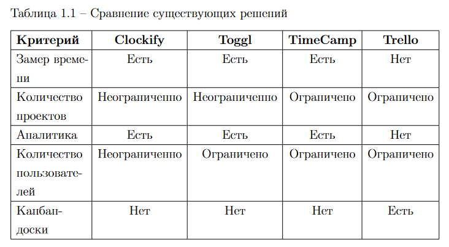
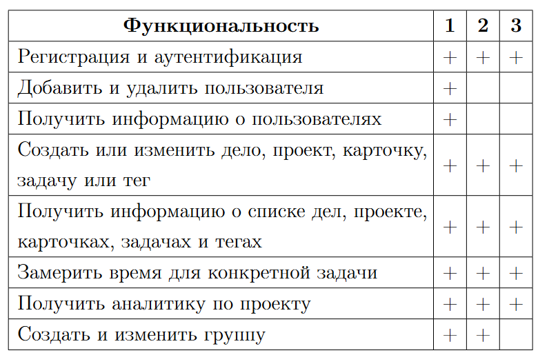
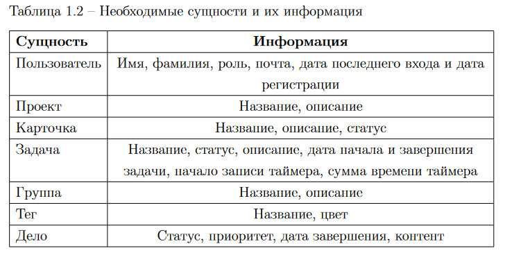
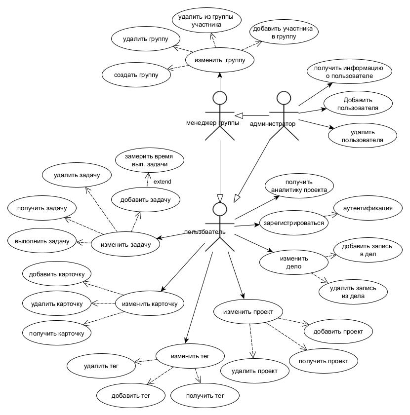
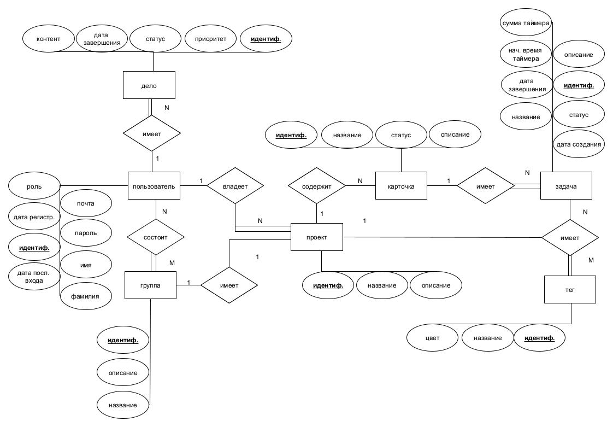
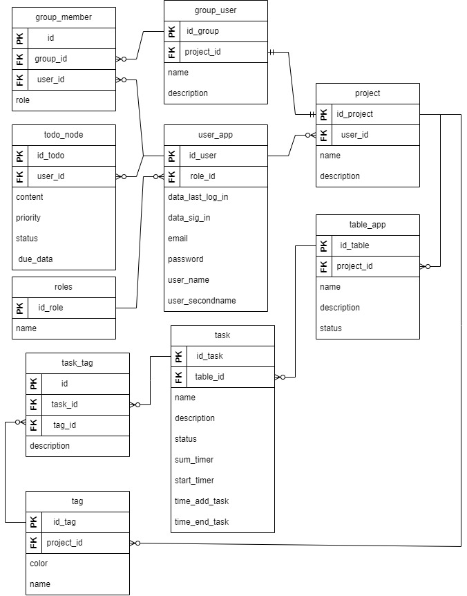
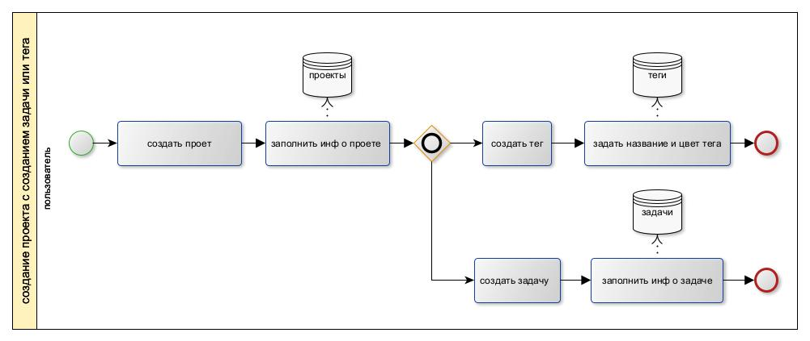
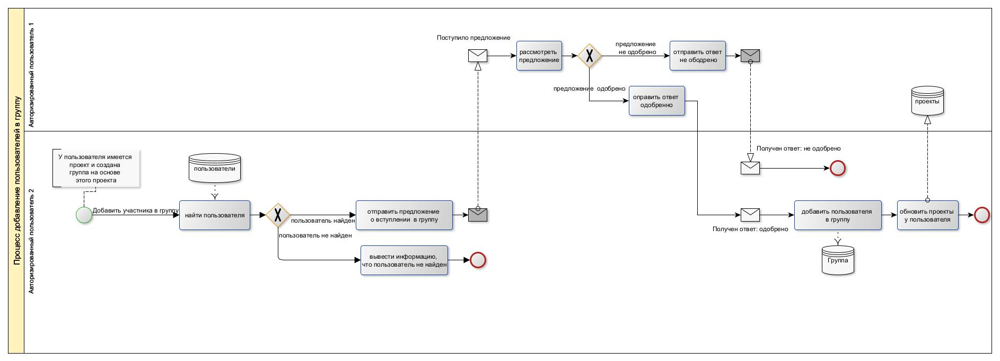
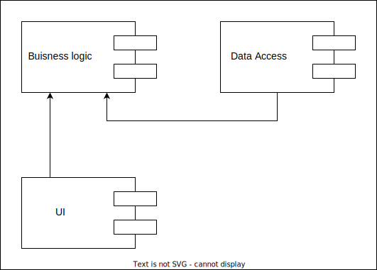
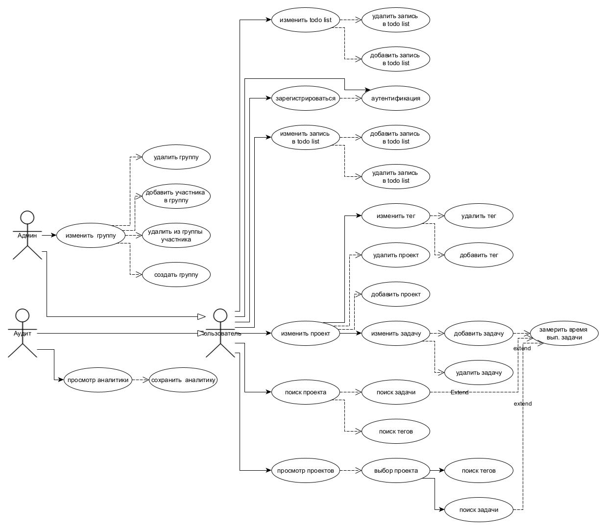

# Effortly-Time-Tracker

> Приложение по учету и аудиту времени, потраченного на рабочие и личные задачи.

> Android application for conveniently measuring time for everyday or work tasks

## Курсач : [coursework.pdf](documentation/img/coursework.pdf)
# Идея

> Приложение для управления задачами и аналитики времени, объединяет функциональность канбан-досок в стиле Trello для планирования и организации проектов, задач и карточек с возможностями измерения времени по методике Toggl Track.
Приложение предназначено для эффективного планирования, как рабочих, так и личных задач, с возможностью группировки пользователей для совместной работы над проектами и задачами.
Основное отличие от остальных приложений — это наличие таймера для отслеживания времени выполнения каждой задачи, организованных в удобные канбан-доски.

## 2) Предметная область

"Управление временем и задачами" --- эта область затрагивает процессы планирования, отслеживания и анализа времени, затрачиваемого на выполнение различных задач и проектов.

> В основе идеи лежат приложения trello (kanban доски) и toggl track (приложение по замеру времени определенной задачи).
Планируется взять из trello создание проектов, карточек, задач и механизм создание групп пользователей.
Из toggl track измерение времени задач и аналитику времени.
По итогу должно получится удобное приложение, которое позволит пользователям планировать рабочие и личные задачи в виде карточек, где можно измерять время потраченное на определенную задачу.

### Видения проблемы

**Шаг 1: Определение проблемы**

Проблема должна быть актуальной и понятной для целевой аудитории.

> "Многие люди и организации сталкиваются с трудностями в эффективном управлении временем из-за отсутствия инструментов для точного учета и анализа затраченного времени на задачи"

**Шаг 2: Центральная идея проекта**

Это должно быть краткое утверждение, отражающее основную цель и предлагаемое решение.

> "Разработка удобного в использовании приложения, которое позволяет пользователям точно учитывать время, затраченное на задачи, и предоставляет аналитику для оптимизации управления временем".

### 3) Анализ аналогичных решений

| Решение      | мое (Effortly-Time-Tracker) | clockify.me | toggl.com/track | timecamp.com | trello.com |
|-| -|-|-|-|-|
|Ограничение бесплатного плана | Полностью бесплатное ПО | Доступ к дополнительным функциям (нет ограничений по количеству пользователей)|До 5 пользователей, только базовые функции|I пользователь, основные функции учета времени| Минимальные возможности по организации и управление  групп и проектов|
|Подходит для| Фрилансерам, Небольшим командам (организациям) и пользователям для отслеживания личных задач  |Предприятия и большие команды, которым требуется хороший трекер и табель учета|Фрилансерам и небольшим командам, с целью простого тайм-менеджмента|Малые предприятия, которым нужен простой тайм-менеджмент, мониторинг работников, выставление счетов|Индивидуальные пользователи и команды для управления проектами и задачами |
|Таймер| ✅ | ✅|✅|✅|❌|
|Неограниченное количество проектов| ✅|✅|✅|$|$|
|Составление отчетов / экспорт данных|✅ CSV | ✅ PDF, CSV, Excel | ✅ PDF, CSV; $ Excel| ✅ \$ PDF, $ Excel|❌ JSON и $CSV|
|Неограниченное количество пользователей| ✅ |✅|$|$|$|
|ПЛАТФОРМЫ | Android |Android / ios / desktop |Android / ios / desktop| Android / ios / desktop | Android / ios |
|канбан-доски| ✅|❌|❌|❌|✅|

### 4) Обоснование целесообразности и актуальности проекта

> Данный проект предлагает инновационное решение — приложение, объединяющее канбан-доски для визуального управления задачами с интегрированным таймером для учета времени на каждую задачу.
Несмотря на популярность канбан-досок среди программистов и широкой аудитории пользователей сервисов вроде Trello, существующий рынок не предлагает инструментов, похожих на мою идею.
Я и мои друзья стакнулись с проблемой, нет удобных сервисов для учета времени задач в виде канбан-досок. Мое приложение должно решить эту проблему.

>Приложение подойдет для личного и корпоративного использования, удовлетворяя запросы как индивидуальных исполнителей, так и организаций с почасовой оплатой труда.

### 5) Роли

Для взаимодействия с приложением по учету и аудиту времени, было
выделено три роли пользователей: администратор, менеджер групп и пользователь.

В таблице представлена функциональность для администратора,
менеджер групп и пользователя. Также в таблице 1.3 используются следующие сокращения: 1 означает роль администратор, 2 — менеджер групп,
3 —пользователь

### 6) Use-Case - диаграмма

[pdf-format](documentation/img/use-case-new-c.pdf)

### 7) ER-диаграмма сущностей

[pdf-format](documentation/img/er_rus.pdf)  

### Диаграмма  БД 

[Развертка](https://dbdiagram.io/d/er-diagram-bd-course-65cdf790ac844320ae364a42)

[pdf-format.pdf](documentation/img/dbDiagramcopy.pdf)

### 9) Формализация бизнес-правил BPMN

Вход в систему.

Создание проекта.

[pdf format](documentation/img/bpmn1.pdf)

### 10) Описание типа приложения и выбранного технологического стека

Тип приложения  -  андроид мобильное приложение (Mobile).
Технологический стек: Kotlin, (Compose UI) (PostgreSQL)

### 11) Верхнеуровневое разбиение на компоненты

## OLD

### 12) UML диаграммы классов

[pdf-format](documentation/img/uml.pdf)

# Use-Case - диаграмма

[pdf-format](documentation/img/use_case.pdf)