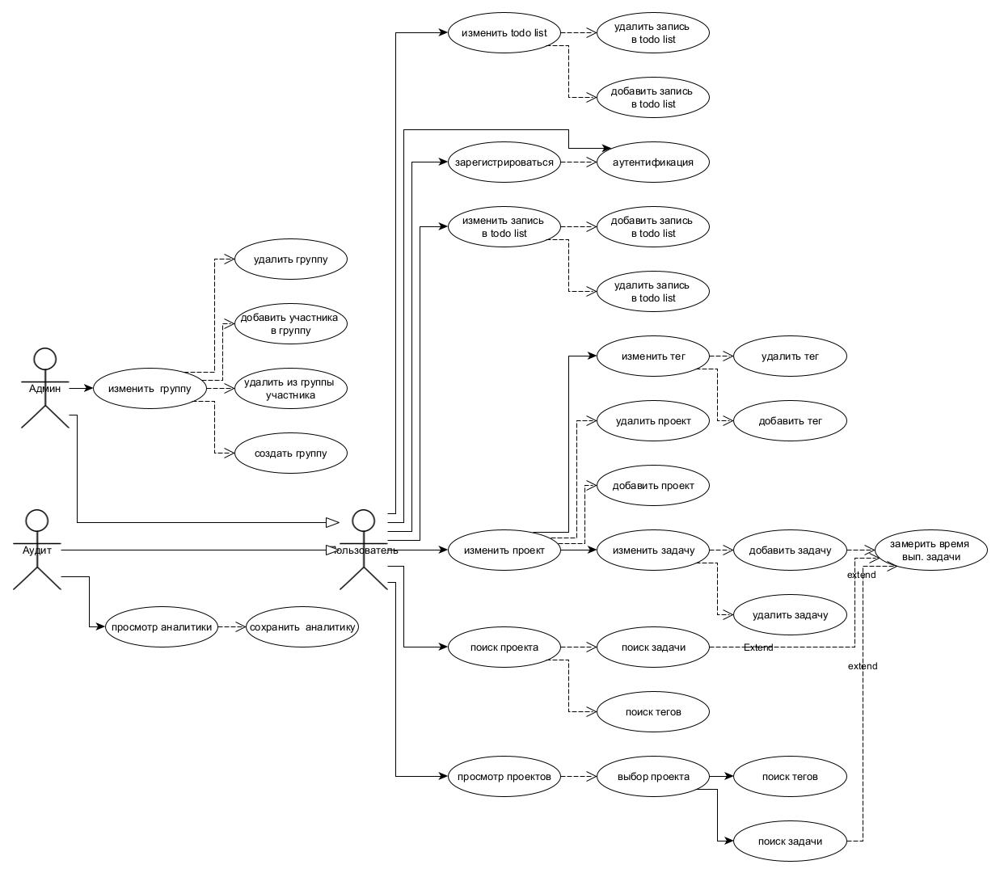
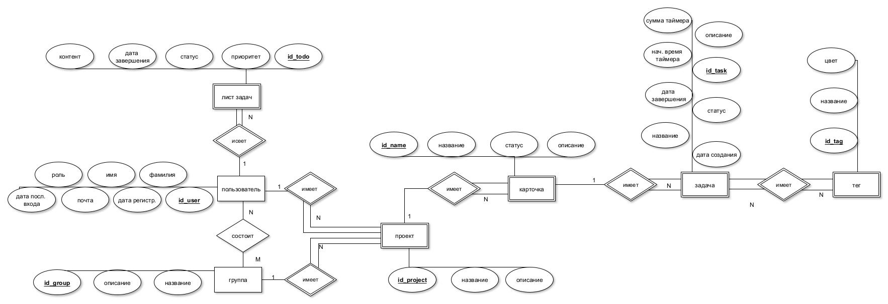
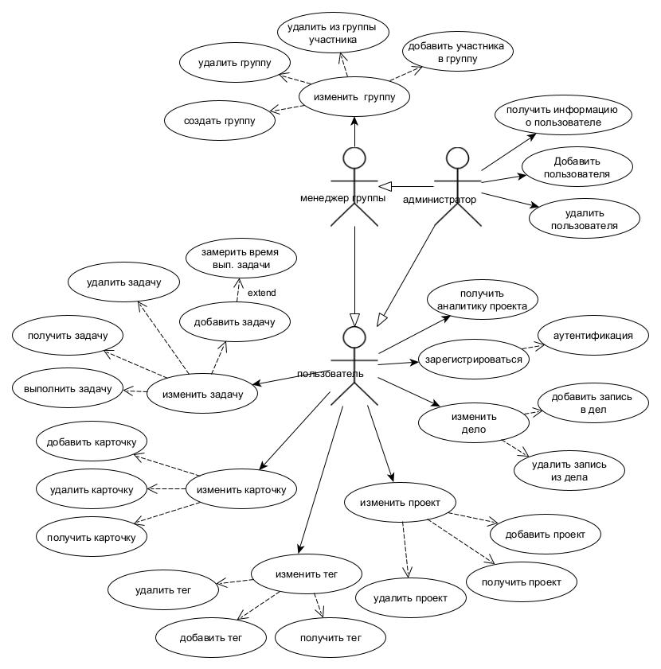
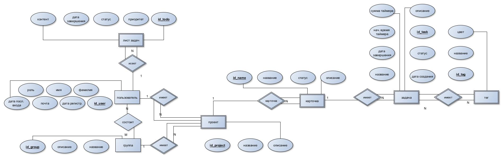
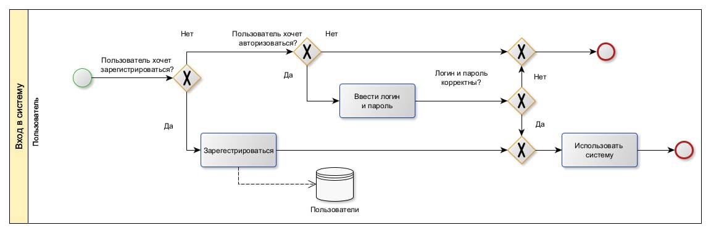
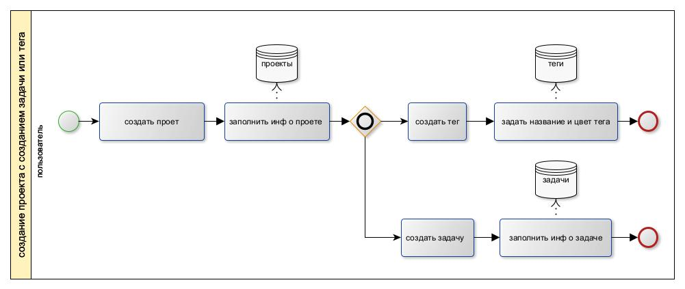
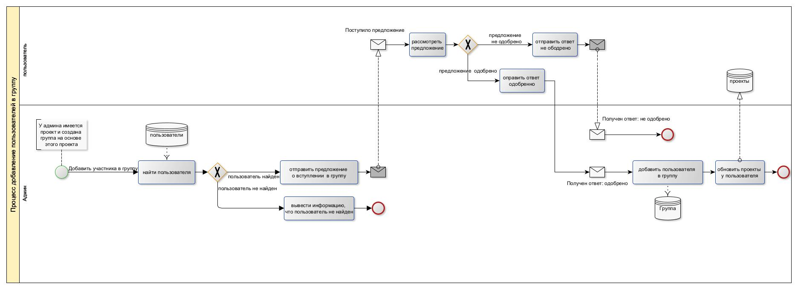

# Effortly-Time-Tracker

Android application for conveniently measuring time for everyday or work tasks

# useful link

[my er](https://vertabelo.com/blog/chen-erd-notation/)  

[my er](https://dbdiagram.io/d/65cdf790ac844320ae364a42)

[ER habr](https://habr.com/ru/articles/440556/)

[ER DIAGRAMS](https://ppt-online.org/157548)

[use case habr DIAGRAMS](https://habr.com/ru/articles/566218/)

[BPMN habr DIAGRAMS](https://habr.com/ru/companies/auriga/articles/667084/)

[BPMN DIAGRAMS](https://systems.education/bpmn-start)

[BPMN видео](https://www.youtube.com/watch?v=E-QVITMNwnQ)

# tz

Разработка базы данных для хранения и обработки данных для  приложения учета и аудита времени, потраченного на рабочие и личные задачи.

**аналит**
Сформулировать описание пользователей проектируемого приложения  по учету и аудиту времени, потраченного на рабочие и личные задачи для доступа к базе данных

**конструкт**
Спроектировать сущности базы данных и ограничения целостности учета и аудита времени, потраченного на рабочие и личные задачи.

**техн**
Выбрать средства реализации базы данных и приложения (в том числе выбор СУБД).

**исслед**
Провести исследование зависимости времени выполнения  запросов от количества записей в базе данных.

# Идея

Приложение для управления задачами и аналитики времени, объединяет функциональность канбан-досок в стиле Trello для планирования и организации проектов, задач и карточек с возможностями измерения времени по методике Toggl Track.
Приложение предназначено для эффективного планирования, как рабочих, так и личных задач, с возможностью группировки пользователей для совместной работы над проектами и задачами.
Основное отличие от остальных приложений — это наличие таймера для отслеживания времени выполнения каждой задачи, организованных в удобные канбан-доски.

<!-- ### идея

В основе идеи лежат приложения trello (kanban доски) и toggl track (приложение по замеру времени определенной задачи).
Планируется взять из trello создание проектов, карточек, задач и механизм создание групп пользователей.
Из toggl track измерение времени задач и аналитику времени.
По итогу должно получится удобное приложение, которое позволит пользователям планировать рабочие и личные задачи в виде карточек, где можно измерять время потраченное на определенную задачу.

Приложение по учету и аудиту времени, потраченного на рабочие и личные задачи. -->

<!-- # todo

- актуальность  

- выписывать интерфейс -->

# Аналит

### видения проблемы

**Шаг 1: Определение проблемы**

Проблема должна быть актуальной и понятной для целевой аудитории.

    "Многие люди и организации сталкиваются с трудностями в эффективном управлении временем из-за отсутствия инструментов для точного учета и анализа затраченного времени на задачи"

**Шаг 2: Центральная идея проекта**

Это должно быть краткое утверждение, отражающее основную цель и предлагаемое решение.

    "Разработка удобного в использовании приложения, которое позволяет пользователям точно учитывать время, затраченное на задачи, и предоставляет аналитику для оптимизации управления временем".

# Предметная область

"Управление временем и задачами" --- эта область затрагивает процессы планирования, отслеживания и анализа времени, затрачиваемого на выполнение различных задач и проектов.

# Анализ аналогичных решений

| Решение      | мое (Effortly-Time-Tracker) | clockify.me | toggl.com/track | timecamp.com | trello.com |
|-| -|-|-|-|-|
|Ограничение бесплатного плана | Полностью бесплатное ПО | Доступ к дополнительным функциям (нет ограничений по количеству пользователей)|До 5 пользователей, только базовые функции|I пользователь, основные функции учета времени| Минимальные возможности по организации и управление  групп и проектов|
|Подходит для| Фрилансерам, Небольшим командам (организациям) и пользователям для отслеживания личных задач  |Предприятия и большие команды, которым требуется хороший трекер и табель учета|Фрилансерам и небольшим командам, с целью простого тайм-менеджмента|Малые предприятия, которым нужен простой тайм-менеджмент, мониторинг работников, выставление счетов|Индивидуальные пользователи и команды для управления проектами и задачами |
|Таймер| ✅ | ✅|✅|✅|❌|
|Неограниченное количество проектов| ✅|✅|✅|$|$|
|Составление отчетов / экспорт данных|✅ CSV | ✅ PDF, CSV, Excel | ✅ PDF, CSV; $ Excel| ✅ \$ PDF, $ Excel|❌ JSON и $CSV|
|Неограниченное количество пользователей| ✅ |✅|$|$|$|
|ПЛАТФОРМЫ | Android |Android / ios / desktop |Android / ios / desktop| Android / ios / desktop | Android / ios |
|канбан-доски| ✅|❌|❌|❌|✅|

На рынке существует несколько сервисов, которые могут объединять функционал канбан-досок и тайм-трекинга, аналогичный вашему приложению. Некоторые из них включают ClickUp, который предлагает управление задачами с документами и чатами, Monday.com, предназначенное для управления проектами в малых и средних организациях, а также Weeek и PlanFix, которые предоставляют набор инструментов для работы в команде и организации совместной работы. Есть также Bitrix24, Asana, Jira, Kanban Tool и Intasker, которые предлагают различные функции для планирования и совместной работы, включая учет времени .

# Обоснование целесообразности и актуальности проекта

Данный проект предлагает инновационное решение — приложение, объединяющее канбан-доски для визуального управления задачами с интегрированным таймером для учета времени на каждую задачу.
Несмотря на популярность канбан-досок среди программистов и широкой аудитории пользователей сервисов вроде Trello, существующий рынок не предлагает инструментов, похожих на мою идею.
Я и мои друзья стакнулись с проблемой, нет удобных сервисов для учета времени задач в виде канбан-досок. Мое приложение должно решить эту проблему.
 Приложение подойдет для личного и корпоративного использования, удовлетворяя запросы как индивидуальных исполнителей, так и организаций с почасовой оплатой труда.

**1.Необходимые требования**

Эти требования являются фундаментальными для функционирования системы и должны быть реализованы в первую очередь. Для проекта по учету времени к таким требованиям могут относиться:

- Возможность регистрации и аутентификации пользователей. (google)
- Функционал создания, редактирования и отслеживания задач и проектов. (статичные карточки)
- Функционал создания и изменения todo list
- Механизм замера времени и привязки его к конкретным задачам.
- Основные отчеты по затраченному времени для индивидуального пользователя.

для админа доп от пользователя :

- создание и редактирование групп пользователей

для аудита доп от пользователя :

- аудит аналитики
- сохрание  аналитики

**2. Желательные требования**

Желательные требования улучшают пользовательский опыт и функциональность системы, но от их реализации можно отказаться без критического ущерба для проекта. Примеры таких требований могут включать:

- для пользователя:
  - Расширенные аналитические отчеты с графиками и диаграммами.
  - добавить интеграцию с гугл календарем
  - Уведомления
  - заметки
  - создавть карточки и прикольная растанока карточек как в  канване

- для админа:
  - ставить принадлежность задаче определнного пользователя группы
  - Мониторинг активности и производительности группы:
  - Управление доступом: Функции для детализированного управления доступом к проектам и задачам на основе ролей и прав пользователей улучшат безопасность и эффективность совместной работы.

- для аудита:
  - доп аналитика
  - История изменений

**3. Возможные требования**

Возможные требования могут быть добавлены в проект, если это позволяют ресурсы и время. Они могут включать функции, которые не являются критически важными, но могут значительно улучшить пользовательский опыт или предоставить дополнительную ценность. Примеры:

- Для пользователя:
  - Возможность экспорта данных в различные форматы (например, CSV, PDF).
  - добавление доп таймеров типа помидора
  - добавить функции выработки привычек
  - мотивационные штучки
  - более гибкое редактирование пространства приложения
  - Многоязычность
  - Резервное копирование и восстановление:
  - Отзывы и обратная связь:

- Для админа:
  - добавление различных ролей у групп
  - добавление у группы групп и назначение мини админов у них

- для аудита:
  - доп аналитика с нейронкой
  
### 5) Роли

Для взаимодействия с приложением по учету и аудиту времени, было выделено три роли пользователей: неавторизированный, авторизированный и администратор.

В таблице ниже представлена функциональность для администратора, неавторизированного и авторизированного пользователя. Также в таблице используются сокращения: 1 означает пользователь администратор, 2 — неавторизированный пользователь, 3 — авторизированный пользователь.

| Функциональность                                     | 1 | 2 | 3 |
|------------------------------------------------------|---|---|---|
| Зарегистрироваться и войти в систему                 | + | + | + |
| Изменить список дел                                  |   | + | + |
| Создать и изменить личный проект, задачи и теги      |   | + | + |
| Провести поиск задач, проектов и тегов               |   | + | + |
| Замерить время для конкретной задачи                 |   | + | + |
| Просмотреть и сохранить аналитику                    |   | + | + |
| Создать группу                                       |   |   | + |
| Изменить группу (если владелец)                      |   |   | + |
| Просмотреть и сохранить аналитику (группы)           | + |   | + |
| Изменить группы пользователей                        | + |   |   |
| Удалить пользователя из системы                      | + |   |   |

# Use-Case - диаграмма

[pdf-format](img/use_case.pdf)

# ER-диаграмма сущностей

[pdf-format](img/er_rus.pdf)  

### 6) Use-Case - диаграмма

[pdf-format](img/use-case-new-c.pdf)

### 7) ER-диаграмма сущностей

[pdf-format](img/er_rus.pdf)  

[Развертка](https://dbdiagram.io/d/er-diagram-bd-course-65cdf790ac844320ae364a42)

### 8) Пользовательские сценарии

Пользователь может не пройти регистрацию и тогда ему будет доступно только личные проекты и базовая функциональность приложения.
Если пользователь зарегистрировался, то он может создать проект и на его основе создать группу (добавить в этот проект других пользователей). Если пользователь владелец группы, то он может ее редактировать (удалять/добавлять пользователей). Администратор сможет удалять авторизированных пользователей из системы, а также редактировать группы (удалять пользователей и удалить группу)

# Формализация бизнес-правил BPMN

Вход в систему.

Создание проекта.

[pdf format](img/bpmn.pdf)

Процесс добавление пользователя в группу.

[pdf format](img/bpmn1.pdf)

## лаб2

### 10) Описание типа приложения и выбранного технологического стека

Тип приложения  -  андроид мобильное приложение (Mobile).
Технологический стек: Kotlin, (Compose UI) (PostgreSQL)

### 11) Верхнеуровневое разбиение на компоненты

### 12) UML диаграммы классов

[uml format](img/uml.pdf)

## Что может это приложение

Приложение по учету и аудиту времени представляет собой комплексный инструмент, разработанный для помощи пользователям в эффективном управлении временем, используемым на повседневные и рабочие задачи. Это решение предназначено как для индивидуальных пользователей, так и для организаций, стремящихся оптимизировать продуктивность и эффективность работы.

Основные возможности приложения включают:

    Регистрация и аутентификация пользователей через Google, обеспечивая безопасный доступ к личным и рабочим данным.
    Управление задачами и проектами с функционалом создания, редактирования и отслеживания прогресса выполнения в удобном статичном карточном интерфейсе.
    Создание и редактирование todo-list'ов, позволяющее пользователям организовывать ежедневные задачи и дела.
    Замер времени выполнения задач, предоставляющий точные данные о времени, затраченном на конкретные действия или проекты.
    Генерация отчетов о времени, предоставляющая индивидуальным пользователям подробный анализ использования времени.

Дополнительные функции для администраторов групп включают:

    Создание и редактирование групп пользователей, упрощая управление командами и проектами внутри организации.

Для роли аудита доступны следующие возможности:

    Аудит и анализ аналитики по группам, что позволяет глубоко понимать распределение времени среди членов команды.
    Сохранение аналитических данных, обеспечивающее возможность отслеживать изменения в эффективности использования времени и корректировать процессы управления.

Это приложение предназначено для тех, кто ищет способы улучшить управление временем, будь то индивидуальные пользователи, желающие повысить свою личную продуктивность, команды, стремящиеся оптимизировать рабочие процессы, или аудиторы, задача которых — анализировать и предоставлять рекомендации по улучшению эффективности использования времени внутри организаций.
